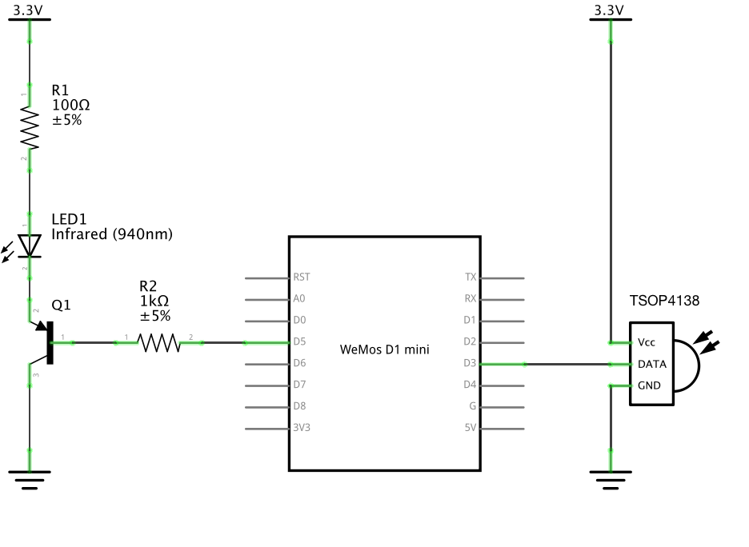

# BlastIR ESP8266 IR Repeater

BlastIR is a dead-simple infra-red repeater using MQTT and the ESP8266.

Record transmitted IR commands by subscribing to `ir/<repeater>/recv` and transmit commands by publishing to `ir/<repeater>/send`

## Setting up a Repeater

BlastIR uses [PlatformIO](http://platformio.org/platformio-ide), so make sure you have VS Code and the PlatformIO extension installed.

1. Download a copy of the BlastIR repository
2. Edit `credentials.h` to include your WiFi and MQTT details
3. Connect a WEMOS D1 Mini and use the `PlatformIO: Upload` command to program the board
4. Wire the board up according to the schematic below

## Schematic



## Recording IR Commands

Subscribe to the MQTT topic you specified in `credentials.h` and use your remote to transmit the desired command while pointed at the repeater.

Example:

    > mosquitto_sub -h 172.23.1.3 -p 1883 -u <user> -P "<pass>" -t 'ir/heatpump/recv'

    <send command using remote>
    ir/heatpump/recv 4357 4422 476 1626 534 1652 503 ...

## Sending IR Commands

To send an IR command, publish data that you recorded earlier to the MQTT topic specified in `credentials.h`.

Example:

    > mosquitto_pub -h 172.23.1.3 -p 1883 -u <user> -P "<pass>" -t "ir/heatpump/send" -m "4357 4422 476 1626 534 1652 503 ..."

## Home Assistant Example

You can transmit IR commands using a Home Assistant automation similar to the following:

```yaml
#
# Transmit an IR OFF signal whenever the heatpump is supposed to turn off
#
- alias: Turn Heatpump Off
  trigger:
    - platform: state
      entity_id: input_boolean.heatpump_should_run
      to: 'off'
  action:
    - service: mqtt.publish
      data:
        topic: "ir/heatpump/send"
        payload: "4400 4400 560 1600 ..."
        qos: 2
```

## Cleaning up Received Data

The output timing of the TSOP4138 can be a bit variable and result in mark/space times with a lot of jitter. If required, you can adjust each duration to match a standard set of durations using the following Python script:

```python
expected_durations = [ 560, 1600, 4400 ]
durations = "4357 4422 476 1626 534 1652 503 ..."
durations = [ int(d) for d in durations.split() ]
durations = [ min(expected_durations, key = lambda usec: abs(d-usec)) for d in durations ]
durations = [ str(d) for d in durations ]

print(" ".join(durations))
```
